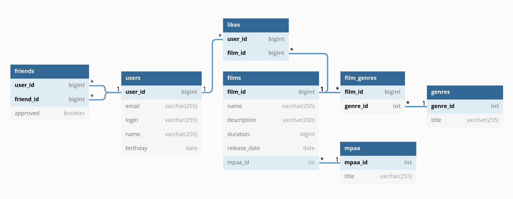

```sql
-- 1. добавление пользователя
INSERT INTO `users` (`email`, `login`, `name`, `birthday`) VALUES ('root@localhost', 'root', '', '1970-01-01');

-- 2. обновление пользователя
UPDATE `users` SET `name` = 'root' WHERE `id` = ?

-- 3. удаление пользователя (+ нам надо удалить пользователя из всех друзей)
DELETE `users` WHERE `id` = ?

-- 4. добавление пользователя в друзья
INSERT INTO `friendships` (`who`, `whom`) VALUES (?, ?)

-- 5. удаление пользователя из друзей
DELETE FROM `friendships` WHERE `who` = ? AND `whom` = ?

-- 6. поиск друзей пользователя
SELECT * FROM `users` WHERE `id` IN
    (SELECT `whom` FROM `friendships` WHERE `who` = ?)
  OR `id` IN
    (SELECT `who` FROM `friendships` WHERE `whom` = ?)

-- 7. поиск общих друзей
SELECT * FROM `users` `u` WHERE `id` IN
    (SELECT `whom` FROM `friendships` WHERE `who` = ?)
  OR id IN
    (SELECT `who` FROM `friendships` WHERE `whom` = ?)
INNER JOIN
(SELECT * FROM `users` WHERE `id` IN
    (SELECT `whom` FROM `friendships` WHERE `who` = ?)
  OR `id` IN
    (SELECT `who` FROM `friendships` WHERE `whom` = ?)) `x` ON `u`.`id` = `x`.`id`

-- 8. добавление фильма
INSERT INTO `films` (`name`, `description`, `release_date`, `duration`, `rating`) VALUES ('Test', '...', '2020-01-01', 3600, 1)

-- 9. обновление фильма
UPDATE `films` SET `description` = 'test' WHERE `id` = ?

-- 10. удаление фильма
DELETE FROM `films` WHERE `id` = ?

-- 11. добавление лайка фильму
INSERT INTO `likes` (`user_id`, `film_id`) VALUES (?, ?)

-- 12. удаление лайка с фильма
DELETE FROM `likes` WHERE `user_id` = ? AND `film_id` = ?

-- 13. список популярных фильмов
SELECT `films`.`id`, COUNT(`likes`.`user_id`) `likes_count`
FROM `films`
LEFT JOIN `likes` ON `films`.`id` = `likes`.`film_id`
GROUP BY `films`.`id`
ORDER BY `likes_count` DESC

-- 14. поиск жанров фильма
SELECT *
FROM `films`
INNER JOIN `film_genres` ON `film_genres`.`film_id` = `films`.`id`
INNER JOIN `genres` ON `genres`.`id` = `film_genres`.`genre_id`
```
